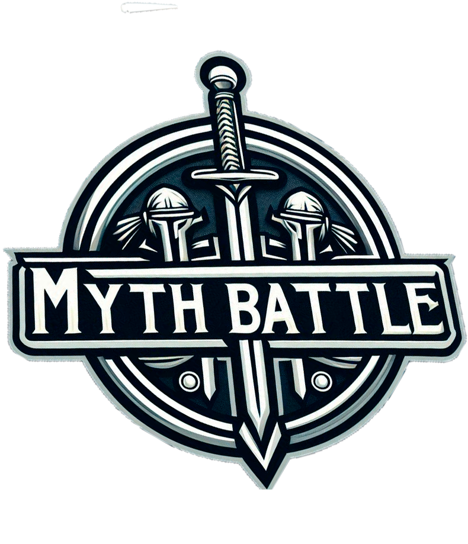
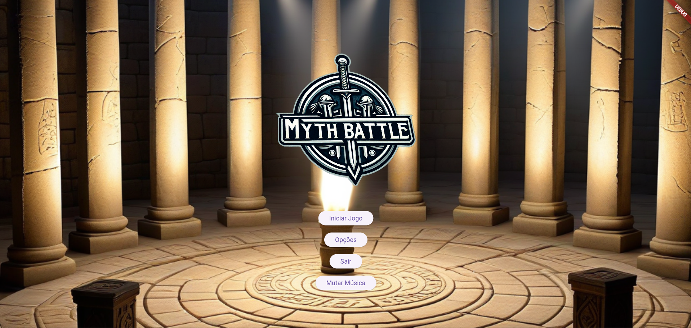
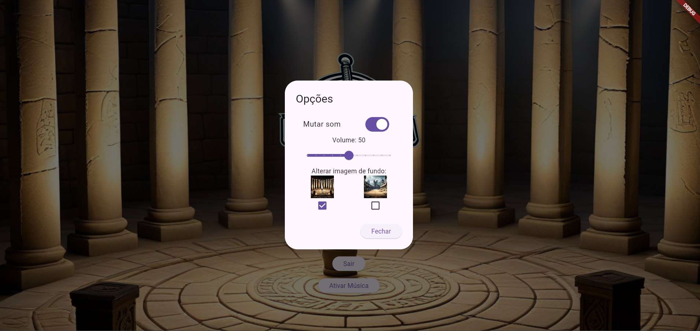
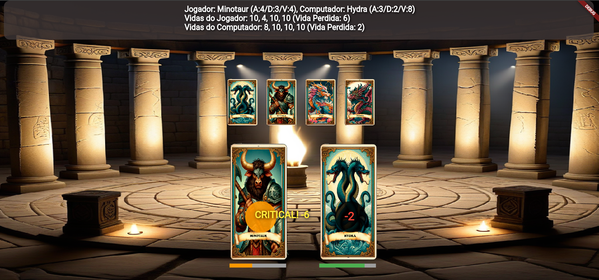

<p align="center">
  
</p>
<p align="center">
  
</p>
# 🃏 Card Game - Flutter & Flame

Este é um jogo de cartas desenvolvido com Flutter e Flame Engine, onde o jogador e o computador se enfrentam utilizando cartas com diferentes valores de ataque, defesa e vida. O jogo inclui animações, efeitos sonoros e uma mecânica de combate simples.Foi desenvolvido com o intuito de aprender mais sobre a Flame Engine e o Flutter sendo um projeto bem simples.

## 🚀 Funcionalidades

- Combate por turnos entre o jogador e o computador.
- Cartas com diferentes valores de ataque e defesa.
- Sistema de pontos de vida com barras de vida para cada carta.
- Animações de ataque e perda de vida.
- Efeitos sonoros para ataque, vitória e derrota.
- Interface interativa com toque para selecionar cartas.

## 🖼️ Screenshots e Video

<table>
  <tr>
    <td></td>
    <td></td>
    <td></td>
    <td></td>
  </tr>
</table>

## ⚙️ Pré-requisitos

Para rodar o projeto, você precisará de:

- [Flutter](https://flutter.dev/docs/get-started/install) (versão 3.x ou superior)
- [Flame Engine](https://docs.flame-engine.org/latest/)
- [AudioPlayers](https://pub.dev/packages/audioplayers) para tocar os efeitos sonoros

## 📦 Instalação

1. Clone o repositório:
   ```bash
   git clone https://github.com/Sub-Dev/card_game.git
   ```
2. Navegue até a pasta do projeto:
   ```bash
   cd card_game
   ```
3. Instale as dependências:
   ```bash
   flutter pub get
   ```
4. Executar na web

   ```bash
   flutter run -d chrome
   ```

## 🎮 Como jogar

- Ao iniciar o jogo, você verá quatro cartas disponíveis.
- Toque em uma carta para jogá-la contra o computador.
- As cartas do jogador e do computador serão comparadas em termos de ataque e defesa.
- O jogo terminará quando todas as cartas de um dos lados perderem toda a sua vida.

## 🎮 Controles

- Toque na carta: Seleciona a carta do jogador para atacar.
- Toque na tela após o jogo terminar: Reinicia o jogo.

## 🎮 Mecânica de Jogo

- Cada carta possui valores distintos de ataque e defesa.
- Quando a carta do jogador ataca, o dano será calculado com base no valor de ataque do jogador comparado à defesa do computador e se foi um dano critico.
- O computador também contra-atacará na mesma rodada.
- O jogo termina quando todas as cartas de um dos lados forem derrotadas (perderem todos os pontos de vida).

## 📂 Arquivos principais

- game.dart: Contém a lógica principal do jogo, incluindo as animações, eventos de toque e sistema de combate.
- status_background_component.dart: Controla o fundo da área de status do jogo, onde as informações de vida e dano são exibidas.

## 🛠️ Recursos

- Cartas: Cada carta tem uma imagem correspondente que é exibida no jogo (card_0.png, card_1.png, etc.).
- Efeitos sonoros: Sons para ataques, vitória e derrota são tocados durante o jogo.

## 🔧 Como personalizar

- Para adicionar novas cartas, edite as listas cards, cardNames, cardAttack e cardDefense no arquivo card_game.dart.
- Adicione as imagens das novas cartas na pasta assets/images/ e os sons em assets/sounds/.
- As animações de vitória e derrota podem ser personalizadas editando os sprites correspondentes em victory_animation.png e defeat_animation.png.

## 🤝 Contribuições

Contribuições são bem-vindas! Sinta-se à vontade para abrir issues e enviar pull requests.

## 👥 Autor

<table>
 <tr>
 <td alinhar="centro">
 <a href="https://github.com/Sub-Dev" target="_blank">
 
 </a>
 </td>
 <td>
 <strong>Anthony Marin</strong> (Sub-Dev) - <a href="https://github.com/Sub-Dev">Perfil no GitHub</a>
 </td>
 </tr>
</table>

## 📜 Licença

Este projeto está licenciado sob a Licença MIT.
